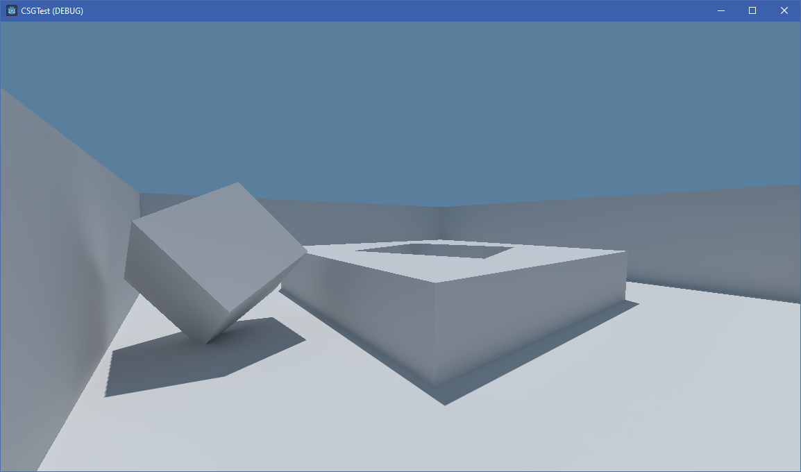

# CSG and baked lightmaps in Godot 4

I adore constructive solid geometry -
why juggle building pieces when you can make a doorway in a wall by adding a frame-box on top of it
and then cutting a hole through both?

[Godot documentation](https://docs.godotengine.org/en/stable/tutorials/3d/csg_tools.html)
suggests to use it for prototyping and then use Qodot+TrenchBroom for actual level design, however:

- I prefer baked lights for their ability to consider environment and light bounces
	(while still remaining fairly "cheap" to process), but I'm unable
	to test it with CSG because it lacks UV mapping.
- TrenchBroom doesn't support concave geometry
	(so an L-shaped block or a floor with a hole in it will be split into multiple parts).
- Godot's lightmappers (both the new LightmapGI and classic BakedLightmap) struggle with
	lighting on adjacent geometry without creating [visible seams](qodot-seams.png) of one or other kind.

Recently I've stumbled upon
[CSGToMeshInstance](https://github.com/StrayEddy/GodotPlugin-CSGToMeshInstance),
a surprisingly simple plugin that adds a "convert to MeshInstance" button to CSGCombined3D nodes,
which, as the name suggests, turns a CSG node into a MeshInstance.

Consequent testing revealed that you can even give it UV2s,
and then you'll even be able to bake lightmaps on it!

So I decided to mash a few things together:

- I tweaked CSGToMeshInstance so that instead of destroying the original CSG node it would
	create/update a MeshInstance next to it, show the MeshInstance, and hide the CSG node.  
	I also added a second button that "reverses the process" (hides MeshInstance and shows CSG).
- I added [this snippet](https://ask.godotengine.org/32229/how-to-unwrap-uv2-for-lightmap-ao-from-gdscript?show=151049#a151049) to auto-generate UV2s after updating the MeshInstance.
- I added [this simple camera script](https://github.com/adamviola/simple-free-look-camera)
	because the implementation from my previous tests needs some tweaking to work in Godot 4
	and I can't be bothered at the moment.

## Unsolved mysteries

- I consider slightly-noisy lightmaps to be an interesting aesthetic to explore
	(especially for games with PS1-like styles and pixelated textures),
	but it would seem that it is no longer possible to disable texture filtering for lightmaps in Godot 4.
- [Can't auto-bake a lightmap](https://github.com/godotengine/godot/issues/59217)
  after updating the MeshInstance.
- Disabling the shadow in a directional light's properties still displays some sort of a (subtler) shadow.
- Texel size shouldn't be hardcoded but I don't want to add a script to CSG that just exposes a single variable.  
	What do people do when you can't add multiple "components"?